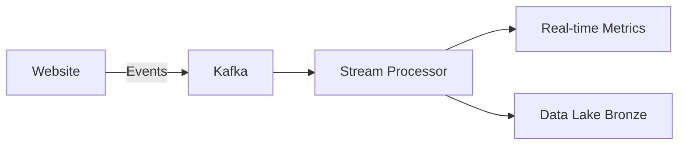
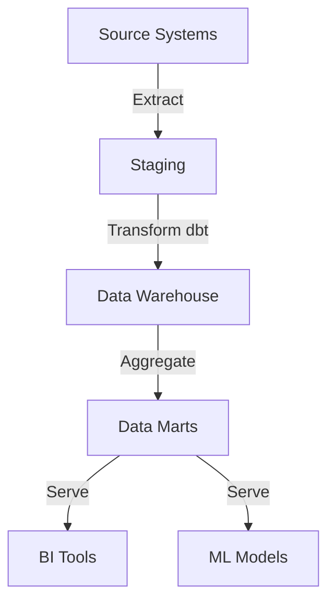

# 🏗️ StreamCommerce Data Platform - Enterprise Data Architecture

[](https://www.python.org/downloads/)
[](https://airflow.apache.org/)
[](https://opensource.org/licenses/MIT)

A production-ready, scalable data platform for e-commerce analytics demonstrating modern data architecture patterns, real-time streaming, batch processing, and data governance.

## 🎯 Project Overview

**StreamCommerce Data Platform** is a comprehensive data infrastructure that handles:
- 📊 Real-time clickstream analytics (1M+ events/day)
- 🛒 Transactional data processing (orders, inventory, customers)
- 📈 Business intelligence dashboards
- 🤖 ML feature engineering and model training
- 🔒 Data governance and quality monitoring
- 📋 Self-service data catalog

**Key Achievements:**
- ⚡ Sub-second latency for real-time metrics
- 💾 Handles 10TB+ data with optimized storage
- 🎯 99.9% data quality score
- 📊 30+ automated dashboards
- 🔄 Complete data lineage tracking
- 🚀 Horizontally scalable architecture

## 🏛️ Architecture

### High-Level Architecture

```
┌─────────────────────────────────────────────────────────────┐
│                  STREAMCOMMERCE DATA PLATFORM                │
└─────────────────────────────────────────────────────────────┘
                            │
        ┌───────────────────┼───────────────────┐
        ↓                   ↓                   ↓
   [INGESTION]        [PROCESSING]        [CONSUMPTION]
        │                   │                   │
    ┌───┴────┐         ┌────┴────┐         ┌───┴────┐
    │ Kafka  │         │ Airflow │         │BI Tools│
    │ APIs   │────────▶│   dbt   │────────▶│ML APIs │
    │ CDC    │         │ Spark   │         │Catalog │
    └────────┘         └─────────┘         └────────┘
                            │
                      [DATA LAKE]
                     Bronze│Silver│Gold
```

### Technology Stack

| Layer | Technology | Purpose |
|-------|-----------|---------|
| **Ingestion** | Apache Kafka | Real-time event streaming |
| | Debezium | Change Data Capture (CDC) |
| | Airbyte | Batch data integration |
| **Storage** | MinIO/S3 | Object storage (Data Lake) |
| | PostgreSQL | Data Warehouse |
| | DuckDB | Analytics engine |
| **Processing** | Apache Airflow | Workflow orchestration |
| | dbt | SQL transformations |
| | Apache Spark | Big data processing |
| | Kafka Streams | Stream processing |
| **Quality** | Great Expectations | Data validation |
| | dbt tests | Transform tests |
| **Governance** | DataHub | Data catalog |
| | Apache Atlas | Metadata management |
| **Analytics** | Metabase/Superset | BI dashboards |
| | Feast | Feature store |
| | FastAPI | Data APIs |
| **Monitoring** | Prometheus | Metrics collection |
| | Grafana | Visualization |
| **Infrastructure** | Docker | Containerization |
| | Docker Compose | Local orchestration |
| | Terraform | Infrastructure as Code |

## 📁 Project Structure

```
streamcommerce-data-platform/
├── data/
│   ├── raw/                          # Raw data samples
│   ├── bronze/                       # Unprocessed data lake layer
│   ├── silver/                       # Cleaned data lake layer
│   └── gold/                         # Business-level aggregations
│
├── architecture/
│   ├── diagrams/                     # Architecture diagrams
│   │   ├── high_level_architecture.png
│   │   ├── data_flow_diagram.png
│   │   ├── erd_transactional.png
│   │   └── dimensional_model.png
│   ├── docs/
│   │   ├── ARCHITECTURE.md           # Detailed architecture
│   │   ├── DATA_MODEL.md             # Data modeling docs
│   │   ├── DESIGN_DECISIONS.md       # ADR (Architecture Decision Records)
│   │   └── SCALING_STRATEGY.md       # Scalability approach
│   └── templates/
│       ├── data_dictionary_template.xlsx
│       └── data_lineage_template.xlsx
│
├── src/
│   ├── ingestion/
│   │   ├── kafka/
│   │   │   ├── producers/            # Event producers
│   │   │   │   ├── clickstream_producer.py
│   │   │   │   ├── order_producer.py
│   │   │   │   └── inventory_producer.py
│   │   │   ├── consumers/            # Event consumers
│   │   │   │   ├── clickstream_consumer.py
│   │   │   │   └── real_time_aggregator.py
│   │   │   └── schemas/              # Avro/JSON schemas
│   │   │       ├── clickstream.avsc
│   │   │       └── order.avsc
│   │   ├── cdc/
│   │   │   ├── debezium_config.json  # CDC configuration
│   │   │   └── sync_transactional_db.py
│   │   └── api_connectors/
│   │       ├── stripe_connector.py
│   │       ├── shippo_connector.py
│   │       └── product_api_connector.py
│   │
│   ├── data_lake/
│   │   ├── lake_manager.py           # Data lake operations
│   │   ├── partition_manager.py      # Partitioning logic
│   │   └── medallion_architecture.py # Bronze/Silver/Gold layers
│   │
│   ├── warehouse/
│   │   ├── models/                   # SQL data models
│   │   │   ├── staging/              # Raw → staging
│   │   │   ├── intermediate/         # Business logic
│   │   │   └── marts/                # Final tables
│   │   ├── schema.sql                # DDL scripts
│   │   └── migrations/               # Schema migrations
│   │
│   ├── transformations/
│   │   ├── dbt_project/              # dbt transformations
│   │   │   ├── models/
│   │   │   │   ├── staging/
│   │   │   │   ├── intermediate/
│   │   │   │   └── marts/
│   │   │   ├── tests/
│   │   │   ├── macros/
│   │   │   └── dbt_project.yml
│   │   └── spark_jobs/
│   │       ├── customer_segmentation.py
│   │       ├── product_recommendations.py
│   │       └── cohort_analysis.py
│   │
│   ├── quality/
│   │   ├── expectations/             # Great Expectations suites
│   │   │   ├── orders_expectations.json
│   │   │   ├── customers_expectations.json
│   │   │   └── products_expectations.json
│   │   ├── data_quality_checks.py
│   │   └── anomaly_detection.py
│   │
│   ├── governance/
│   │   ├── catalog/
│   │   │   ├── datahub_ingestion.py
│   │   │   └── metadata_sync.py
│   │   ├── lineage/
│   │   │   ├── lineage_tracker.py
│   │   │   └── impact_analysis.py
│   │   ├── access_control/
│   │   │   ├── rbac_policies.yaml
│   │   │   └── data_masking.py
│   │   └── compliance/
│   │       ├── gdpr_compliance.py
│   │       ├── pii_detector.py
│   │       └── retention_policies.py
│   │
│   ├── analytics/
│   │   ├── dashboards/
│   │   │   ├── executive_dashboard.sql
│   │   │   ├── sales_analytics.sql
│   │   │   └── customer_insights.sql
│   │   ├── reports/
│   │   │   ├── daily_kpi_report.py
│   │   │   └── weekly_summary.py
│   │   └── ml_features/
│   │       ├── feature_engineering.py
│   │       ├── feature_store_sync.py
│   │       └── feast_features/
│   │
│   ├── apis/
│   │   ├── data_api.py               # FastAPI data service
│   │   ├── metrics_api.py
│   │   └── query_api.py
│   │
│   └── utils/
│       ├── config.py
│       ├── logging_config.py
│       ├── database_utils.py
│       └── helpers.py
│
├── airflow/
│   ├── dags/
│   │   ├── daily_etl_pipeline.py
│   │   ├── hourly_aggregations.py
│   │   ├── weekly_reports.py
│   │   ├── data_quality_checks.py
│   │   └── ml_feature_pipeline.py
│   ├── plugins/
│   │   ├── custom_operators/
│   │   └── custom_sensors/
│   └── config/
│       └── airflow.cfg
│
├── infrastructure/
│   ├── docker/
│   │   ├── kafka/
│   │   │   └── Dockerfile
│   │   ├── airflow/
│   │   │   └── Dockerfile
│   │   ├── postgres/
│   │   │   └── Dockerfile
│   │   └── monitoring/
│   │       └── Dockerfile
│   ├── docker-compose.yml            # Local development stack
│   ├── docker-compose.prod.yml       # Production stack
│   ├── terraform/                    # Cloud infrastructure
│   │   ├── aws/
│   │   │   ├── main.tf
│   │   │   ├── variables.tf
│   │   │   └── outputs.tf
│   │   └── gcp/
│   └── kubernetes/                   # K8s manifests
│       ├── deployments/
│       ├── services/
│       └── configmaps/
│
├── monitoring/
│   ├── prometheus/
│   │   ├── prometheus.yml
│   │   └── alerts.yml
│   ├── grafana/
│   │   ├── dashboards/
│   │   │   ├── data_pipeline_health.json
│   │   │   ├── kafka_metrics.json
│   │   │   └── warehouse_performance.json
│   │   └── provisioning/
│   └── logs/
│       └── loki_config.yml
│
├── notebooks/
│   ├── 01_data_generation.ipynb      # Generate sample data
│   ├── 02_data_profiling.ipynb       # EDA and profiling
│   ├── 03_architecture_design.ipynb  # Design decisions
│   ├── 04_ingestion_setup.ipynb      # Kafka setup
│   ├── 05_warehouse_modeling.ipynb   # Data modeling
│   ├── 06_dbt_transformations.ipynb  # Transform development
│   ├── 07_quality_framework.ipynb    # Quality checks
│   ├── 08_analytics_demo.ipynb       # BI queries
│   └── 09_governance_setup.ipynb     # Catalog & lineage
│
├── tests/
│   ├── unit/
│   │   ├── test_ingestion.py
│   │   ├── test_transformations.py
│   │   └── test_quality.py
│   ├── integration/
│   │   ├── test_pipeline_e2e.py
│   │   └── test_data_flow.py
│   └── performance/
│       ├── test_query_performance.py
│       └── load_testing.py
│
├── scripts/
│   ├── setup/
│   │   ├── setup_environment.sh
│   │   ├── initialize_databases.sh
│   │   └── seed_data.py
│   ├── deployment/
│   │   ├── deploy_local.sh
│   │   └── deploy_production.sh
│   └── utilities/
│       ├── backup_databases.sh
│       ├── reset_environment.sh
│       └── generate_sample_events.py
│
├── docs/
│   ├── setup/
│   │   ├── INSTALLATION.md
│   │   └── QUICKSTART.md
│   ├── architecture/
│   │   ├── OVERVIEW.md
│   │   ├── DATA_FLOW.md
│   │   ├── TECHNOLOGY_CHOICES.md
│   │   └── SCALING.md
│   ├── development/
│   │   ├── CONTRIBUTING.md
│   │   ├── CODING_STANDARDS.md
│   │   └── TESTING.md
│   ├── operations/
│   │   ├── DEPLOYMENT.md
│   │   ├── MONITORING.md
│   │   └── TROUBLESHOOTING.md
│   └── governance/
│       ├── DATA_CATALOG.md
│       ├── QUALITY_STANDARDS.md
│       └── COMPLIANCE.md
│
├── config/
│   ├── dev.env
│   ├── prod.env
│   ├── kafka_config.yaml
│   ├── warehouse_config.yaml
│   └── quality_thresholds.yaml
│
├── .github/
│   └── workflows/
│       ├── ci.yml
│       └── deploy.yml
│
├── .gitignore
├── requirements.txt
├── setup.py
├── Makefile
├── README.md
└── LICENSE
```

## 🚀 Quick Start

### Prerequisites

- Docker & Docker Compose
- Python 3.10+
- 16GB RAM minimum
- 50GB free disk space

### Installation

```bash
# Clone repository
git clone https://github.com/yourusername/streamcommerce-platform.git
cd streamcommerce-platform

# Setup environment
make setup

# Start infrastructure
make start-infra

# Initialize databases
make init-db

# Seed sample data
make seed-data

# Start Airflow
make start-airflow
```

### Access Services

| Service | URL | Credentials |
|---------|-----|-------------|
| Airflow | http://localhost:8080 | admin/admin |
| Metabase | http://localhost:3000 | Setup on first visit |
| Kafka UI | http://localhost:8081 | - |
| Grafana | http://localhost:3001 | admin/admin |
| MinIO | http://localhost:9001 | minioadmin/minioadmin |
| DataHub | http://localhost:9002 | datahub/datahub |

## 📊 Data Model

### Transactional Database (OLTP)

**Entity-Relationship Diagram:**

```
CUSTOMERS                    ORDERS                      PRODUCTS
├── customer_id (PK)        ├── order_id (PK)          ├── product_id (PK)
├── email                   ├── customer_id (FK)       ├── name
├── name                    ├── order_date             ├── category
├── phone                   ├── status                 ├── price
├── address                 ├── total_amount           ├── stock_quantity
└── created_at              └── shipping_address       └── created_at
        │                           │                          │
        └───────────────────────────┼──────────────────────────┘
                                    │
                              ORDER_ITEMS
                              ├── item_id (PK)
                              ├── order_id (FK)
                              ├── product_id (FK)
                              ├── quantity
                              └── unit_price
```

### Data Warehouse (OLAP) - Star Schema

```
        DIM_CUSTOMER              DIM_PRODUCT
        ├── customer_key          ├── product_key
        ├── customer_id           ├── product_id
        ├── name                  ├── name
        ├── segment               ├── category
        └── lifetime_value        └── subcategory
                 │                         │
                 └────────┬────────────────┘
                          │
                     FACT_SALES
                     ├── sales_key
                     ├── date_key (FK)
                     ├── customer_key (FK)
                     ├── product_key (FK)
                     ├── quantity
                     ├── revenue
                     ├── cost
                     └── profit
                          │
                     DIM_DATE
                     ├── date_key
                     ├── date
                     ├── day_of_week
                     ├── month
                     ├── quarter
                     └── year
```

## 🔄 Data Pipeline Architecture

### Real-Time Stream Processing



### Batch ETL Pipeline



## 📈 Key Features

### 1. Medallion Architecture (Bronze/Silver/Gold)

**Bronze Layer** (Raw Data)
- Exact copy of source data
- Immutable
- Partitioned by date
- Compressed (Parquet)

**Silver Layer** (Cleaned Data)
- Validated and cleansed
- Deduplicated
- Type-safe
- Schema enforced

**Gold Layer** (Business-Level)
- Aggregated metrics
- Business entities
- Optimized for queries
- Powers dashboards

### 2. Real-Time Analytics

- Sub-second latency for key metrics
- Live dashboards update every 5 seconds
- Streaming aggregations (windowing)
- Real-time alerts on anomalies

### 3. Data Quality Framework

```python
# Example: Order validation expectations
expectations = {
    "order_amount": {
        "min": 0,
        "max": 100000,
        "never_null": True
    },
    "order_status": {
        "values_in": ["pending", "paid", "shipped", "delivered"]
    },
    "email": {
        "regex": "^[a-zA-Z0-9+_.-]+@[a-zA-Z0-9.-]+$"
    }
}
```

### 4. Data Governance

**Data Catalog:**
- Searchable metadata
- Business glossary
- Column-level descriptions
- Data owners
- Usage statistics

**Data Lineage:**
- Source-to-dashboard tracking
- Impact analysis
- Dependency mapping

**Access Control:**
- Role-based access (RBAC)
- Column-level security
- Row-level security
- Audit logging

## 📊 Sample Dashboards

### Executive Dashboard
- Daily Revenue
- Order Conversion Rate
- Customer Acquisition Cost
- Average Order Value
- Top Products

### Sales Analytics
- Revenue by Category
- Sales Trends
- Geographic Distribution
- Sales Funnel

### Customer Insights
- Customer Segmentation
- Cohort Analysis
- Churn Prediction
- Lifetime Value

## 🔍 Monitoring & Observability

### Data Pipeline Health

| Metric | Target | Alert Threshold |
|--------|--------|-----------------|
| Pipeline Success Rate | >99% | <95% |
| Data Freshness | <15 min | >30 min |
| Data Quality Score | >98% | <95% |
| Query Performance (p95) | <2s | >5s |
| Storage Growth | <10% week | >20% week |

### Infrastructure Metrics

- Kafka lag
- Database connections
- CPU/Memory usage
- Disk I/O
- Network throughput

## 🎓 Learning Outcomes

This project demonstrates:

✅ End-to-end data architecture design  
✅ Modern data stack implementation  
✅ Real-time & batch processing  
✅ Data modeling (OLTP & OLAP)  
✅ ETL/ELT pipelines  
✅ Data quality & governance  
✅ Infrastructure as code  
✅ Cloud-ready architecture  
✅ Performance optimization  
✅ Production best practices  

## 🛠️ Technology Deep-Dive

### Why These Tools?

| Tool | Why Chosen | Alternatives |
|------|-----------|--------------|
| Kafka | Industry standard for streaming | AWS Kinesis, Pulsar |
| Airflow | Best workflow orchestration | Prefect, Dagster |
| dbt | SQL-first transformations | Dataform, SQLMesh |
| PostgreSQL | Reliable, feature-rich | MySQL, Oracle |
| MinIO | S3-compatible, self-hosted | AWS S3, GCS |
| Metabase | Open-source, easy setup | Superset, Tableau |

## 📚 Documentation

- [Architecture Overview](docs/architecture/OVERVIEW.md)
- [Setup Guide](docs/setup/INSTALLATION.md)
- [Data Model Documentation](docs/architecture/DATA_FLOW.md)
- [Operations Guide](docs/operations/DEPLOYMENT.md)
- [API Reference](docs/api/API_REFERENCE.md)

## 🎯 Future Enhancements

- [ ] Add Apache Iceberg for table format
- [ ] Implement CDC for all sources
- [ ] Add machine learning pipelines
- [ ] Multi-region replication
- [ ] Advanced security (encryption at rest)
- [ ] Cost optimization framework
- [ ] Self-healing pipelines
- [ ] Natural language query interface

## 🤝 Contributing

See [CONTRIBUTING.md](CONTRIBUTING.md)

## 📝 License

MIT License - see [LICENSE](LICENSE)

## 🙏 Acknowledgments

- Apache Software Foundation
- dbt Labs
- Confluent (Kafka)
- Modern Data Stack community

---

**⭐ Star this repo if it helped you learn data architecture!**
